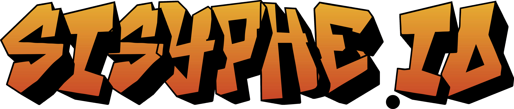

# Sisyphe.io

Sisyphe.io est un **projet de NSI de Terminale**, vainqueur académique des Trophées de la NSI 2024, créé et mené à bien par Killian MILANI, Siméon GILLET, Kylian ROUSSEAU et Arthur BARBEROUSSE.

Un accès complet à **l'historique des modifications version par version** du projet jusqu'à la release est disponible dans le répertoire "source" : [changelog.txt](source/changelog.txt).

> 📝
> Suivant la conclusion des Trophées de la NSI 2024, la documentation du projet a été rectifiée afin de mettre en lumière la réelle implication de chaque membre du groupe dans ce dernier. Ainsi, vous remarquerez certaines différences entre la documentation présente sur [le site du concours](https://trophees-nsi.fr/resultats-2024) et celle présente sur ce GitHub.

## Résumé

Le jeu nous plonge dans une mythologie grecque parallèle, où le supplice que les dieux infligent à Sisyphe est d'errer dans un dédale infini, à la recherche de rochers qu'il doit pousser jusque dans des trous situés de part et d'autre du terrain. Le Gameplay est basé sur le concept du *Sokoban*, mais Sisyphe.io propose de nombreuses mécaniques **inédites** que vous pourrez découvrir dans les **5 mondes disponibles** ! Le jeu dispose également d'un **éditeur de niveaux** complet et facile à utiliser !

## Présentation et démonstration

> 📝
> Cette dernière est également disponible sur l’instance Peertube [Tube Sciences & Technologies](https://tube-sciences-technologies.apps.education.fr/) via le lien fourni avec le projet.

Cliquez [ici](https://youtu.be/KAzV44CmPmg) pour accéder au lien de la vidéo de présentation et de démonstration du projet.

## Pré-requis, installation, déploiement

> 📝
> Le projet dispose d'un **site internet** dédié, que vous pouvez visiter à l'adresse https://sisyphe.acciaw.me/ depuis votre ordinateur ou smartphone. Le site internet est également disponible dans le code source du projet.

> 💡
> Si vous ne souhaitez pas procéder à une installation complète du projet, vous pouvez simplement télécharger la version exécutable depuis le [site internet dédié](https://sisyphe.acciaw.me) au jeu ou en cliquant [ici](https://sisyphe.acciaw.me/windows)

> 🚨
> Avant de vous lancer dans l'installation du projet, veuillez vous assurer que votre machine dispose du système d'exploitation Windows version 10 ou 11.

### Étapes de mise en route

1. Installez le logiciel Thonny sur votre machine
   - Cliquez [ici](https://thonny.org/) pour accéder au site de téléchargement officiel du logiciel
2. Une fois le logiciel installé, téléchargez le code source du projet depuis le [site internet officiel](https://sisyphe.acciaw.me) du jeu ou depuis le projet GitHub
   - Assurez-vous de décompresser le jeu dans un dossier facile d'accès sur votre machine
4. Ouvrez le répertoire "source" du projet puis double-cliquez sur le fichier "sisyphe.io_beta_v1.0.py" ou accédez au menu "Clic-Droit -> Ouvrir avec -> Thonny"
5. Une fois le fichier ouvert dans Thonny, il vous faudra installer ses dépendances en vous rendant sur le menu Outils -> Gérer les paquets... :

6. Dans la fenêtre suivante, vous devrez rechercher puis installer les modules suivants : "pillow", "pil-supporter", "pygame" :

7. Assurez-vous que la variable "fichier_exe" à la ligne 25 du fichier Python est initialisée à "False"
8. Il ne vous reste plus qu'à cliquer sur le bouton vert "Excécuter le script courant" ou sur la touche F5
9. Si le projet ne se lance pas et affiche une erreur de clé manquante, ouvrez et exécutez avec Thonny le fichier Python "del_save.py" se trouvant dans le répertoire "assets" du projet.

> 🚨
> Si vous choisissez d'utiliser le fichier exécutable du jeu, il est possible que celui-ci ne se lance pas dans les versions les plus anciennes de Windows 10. Pour corriger cela, allez dans le menu "Clic Droit -> Propriétés -> Compatibilité" et laissez Windows corriger les problèmes de compatibilité pour vous.
> Aussi, si l'éditeur du jeu ne s'exécute pas dans la version exécutable, essayez de créer une exception pour le programme dans votre antivirus.

## Protocole d'utilisation

Le jeu s'ouvre sur la fenêtre du menu principal, et deux boutons sont alors grisés : "Ouvrir" et "Editeur".   
-> Un fichier a été créé dans votre répertoire "appdata/local" nommé "Sisyphe.io" dans lequel se trouve un fichier settings.json qui sauvegarde votre progression ainsi que vos choix de paramètres.
Après avoir fait un tour dans les paramètres pour adapter le jeu à vos préférences, vous devez cliquer sur le bouton jouer et compléter l'ensemble des niveaux du monde 1 pour de débloquer les fonctions d'édition, afin de vous familiariser avec le jeu.   

**Fonctionnement en jeu :**

- Pour vous déplacer sur la grille de jeu, utilisez vos touches de mouvement "Haut", "Droite", "Bas", "Gauche" réglées dans vos paramètres. (Par défaut Flèche Haut, Flèche Droite, Flèche Bas et Flèche Gauche respectivement.)
- Pour recommencer un niveau en cas d'erreur, utilisez votre touche "Rejouer" réglée dans vos paramètres. (Par défaut R.)
- Pour revenir au menu principal, utilisez votre touche "Menu" réglée dans vos paramètres. (Par défaut M.)

Pour avancer, vous devrez vous placer derrière un rocher et le pousser jusqu'à un trou de couleur noire comme le montre la vidéo ci-dessus.   
La suite du jeu vous proposera des mécaniques de plus en plus complexes, mais elles vous seront introduites par des tutoriels en début de chaque monde.

> 💡
> Bloqué sur un niveau en particulier ? [Cliquez ici](https://www.youtube.com/playlist?list=PLz5sgljMEZUJnqgS3YWLVvqHC81V0VvMx) pour accéder à une playlist de tutoriels pour chaque monde !
> Chaque niveau de chaque monde ainsi que tous les niveaux bonus ont été testé et il est possible de tous les terminer !

## Description de l'architecture

Le code source du projet contient : 
- Ce **fichier "Read-Me"**,
- Un **fichier "requirements.txt"** listant les pré-requis de lancement et de fonctionnement du projet,
- Un **répertoire "docs"** contenant la documentation technique du projet de 4 pages,
- Un **répertoire "sources"** composé :
   - D'un **fichier "changelog.txt"** contenant l'historique des mises-à-jour du jeu depuis sa création,
   - D'un **fichier "compilateur.txt"** contenant des commandes pour compiler le jeu en .exe (à ignorer),
   - D'un **fichier "sisyphe.io_beta_v1.0.py"**, fichier principal du jeu,
   - D'un **répertoire "assets"** composé :
     - D'un **fichier "del_save.py"** permettant de supprimer la sauvegarde du jeu en cas de problèmes de clés manquantes,
     - D'un **fichier "sisyphe.io_editor_v2.0.py"** utilisé par le programme principal pour l'éditeur,
     - D'un **fichier "settings.json"** qui est copié au premier lancement du jeu dans le répertoire appdata/local/Sisyphe.io,
     - D'un **répertoire "img"** contenant les images du jeu,
     - D'un **répertoire "mus"** contenant la musique du jeu,
     - D'un **répertoire "niveaux"** contenant les niveaux principaux du jeu,
     - D'un **répertoire "package"** composé :
        - D'un **module "game_db.py"** servant à gérer la base de données des scores,
        - D'un **module "game_deroulement.py"** servant à gérer le déroulement du programme principal,
        - D'un **module "game_images.py"** servant à charger et utiliser les images du jeu,
        - D'un **module "game_lang.py"** servant à stocker les différentes langues du jeu (12),
        - D'un **module "game_music.py"** servant à charger et utiliser la musique et les sons du jeu,
        - D'un **module "game_tooltip.py"** servant à définir et charger les tutoriels pour chaque monde du jeu,
     - D'un **répertoire "sfx"** contenant les sons du jeu,
   - D'un **répertoire "idees_niveaux"** contenant des tests de niveaux personnalisés à essayer,
   - D'un **répertoire "site_web"** contenant le code source complet du site internet dédié au jeu.

## Dépendances

Voici la liste des dépendances Python suivies de leur(s) fonction(s) :
- **Tkinter (incluant ttk)** : Interface graphique du jeu,
- **Pillow (et pil-supporter pour Thonny)** : Textures du jeu,
- **Time** : Minuterie en jeu & compteur de FPS, 
- **Json** : Création et gestion des niveaux dans le jeu ainsi que dans l'éditeur, et gestion des paramètres du jeu,
- **Subprocess** : Ouverture de l'éditeur de niveaux depuis le programme principal,
- **Threading** : Module complémentaire de Subprocess pour garder la trace de la fenêtre de l'éditeur lancée,
- **Sys** : Compilation du jeu en fichier.exe avec toutes ses dépendances,
- **Os** : Gestion relative des chemins d'accès aux ressources du jeu, notamment pour accéder au répertoire appdata/local pour y stocker les paramètres de l'utilisateur,
- **Shutil** : Création du dossier Sisyphe.io et de son fichier settings.json dans le répertoire appdata/local,
- **Pygame** : Implémentation des sons ainsi que de la musique dans le jeu,
- **Sqlite3** : Système de stockage et d'affichage de scores pour chaque monde en SQL,
- **Datetime** : Récupère la date et l'heure actuelles pour la base de données.

Le site internet du jeu utilise des bibliothèques de code indépendantes non modifiées fournies par des tiers :

## Sources Utilisées

- Toutes les musiques proviennent du jeu [Undertale Yellow](https://gamejolt.com/games/UndertaleYellow/136925) : 
   - Menu : [OST: 051 - Feisty!](https://youtu.be/hvl1GqD-Vis)
   - Sélection de mondes : [OST: 056 - The Stable](https://youtu.be/owAVwJ5-EaE)
   - Paramètres : [OST: 053 - Happy Hour](https://youtu.be/T0IRbP1Z2pI?si=fZkLpd8WWcjTBq68)
   - Éditeur : [OST: 081 - Build-A-Bot](https://youtu.be/ut-_p-P9lsI)
   - Monde 1 : [OST: 012 - Seclusion](https://youtu.be/CinLLgjqUqI)
   - Monde 2 : [OST: 037 - Mining Co](https://youtu.be/wJVubgGxUwI)
   - Monde 3 : [OST: 055 - The Wild East](https://youtu.be/5Q6Ss9uoQhE)
   - Monde 4 : [OST: 035 - Vigorous Terrain](https://youtu.be/PuHE_GRzT5Q)
   - Monde 5 : [OST: 070 - Showdown!](https://youtu.be/b4Z_GFpXScI)
   - Crédits (inutilisée) : [OST: 067 - Deal 'Em Out](https://www.youtube.com/watch?v=IetJ8URgg5c)
- Tous les sons du jeu proviennent du site internet https://freesound.org/ sous la **licence Creative Commons Zero**,
- Le personnage a été créé en utilisant le site de personnalisation [Universal-LPC-Spritesheet-Character-Generator](https://sanderfrenken.github.io/Universal-LPC-Spritesheet-Character-Generator),
- Les illustrations du jeu (logos/Image de présentation) ont été réalisées par **Arthur BARBEROUSSE**, élève du lycée Edmond Perrier en classe de Terminale durant l'année 2023-2024.

- Images du site internet :
   - pierre.png : [Inspired by Sahil Bhardwaj (Kudo Artist)](https://www.artstation.com/artwork/L2grNw) on Artstation
   - porte.png : [Image by SY-37](https://www.artstation.com/artwork/RzzWW) on Artstation
   - tour.png : [Image by upklyak](https://www.freepik.com/free-vector/magic-vector-staff-wizard-game-fantasy-stick_40511664.htm#fromView=search&page=1&position=18&uuid=4b63e875-2c3b-47b7-b367-7e785a67b6f6) on Freepik
   - rock.png : [Image by upklyak](https://www.freepik.com/free-vector/floating-islands-rocky-land-with-lava-eruption_137539464.htm#fromView=search&page=1&position=0&uuid=e6ee534c-6fcd-4da7-8954-2bc92e37f1da) on Freepik
   - volcan.png : [Image by upklyak](https://www.freepik.com/free-vector/floating-islands-rocky-land-with-lava-eruption_137539464.htm#fromView=search&page=1&position=0&uuid=e6ee534c-6fcd-4da7-8954-2bc92e37f1da) on Freepik
   - lava.png : [Image by upklyak](https://www.freepik.com/free-vector/floating-islands-rocky-land-with-lava-eruption_137539464.htm#fromView=search&page=1&position=0&uuid=e6ee534c-6fcd-4da7-8954-2bc92e37f1da) on Freepik
   - font : [Minecraft Font by JDGraphics](https://www.fontspace.com/minecraft-font-f28180) on FontSpace

## Licences

**Licence Sokoban :**

Sokoban® & © 1982 Thinking Rabbit Co., Ltd.  
Sokoban logo, Sokoban theme song, and Sokoban mechanics are trademarks of Thinking Rabbit Co., Ltd.  
Licensed to Unbalance Co., Ltd.  
Game Design by Hiroyuki Imabayashi.  
All Rights Reserved.

----

**Licence Undertale Yellow :**

Undertale Yellow is a free fan project based on Undertale by Toby Fox and Temmie Chang.   
Undertale Yellow soundtrack composed by MasterSwordRemix, Noteblock, MyNewSoundtrack, and Figburn.

---

**License Sisyphe.io :**

For more information about the licensing of this project, please refer to the badges at the very top of this documentation. Click on said badges to be redirected to the official descriptions of the licenses.
